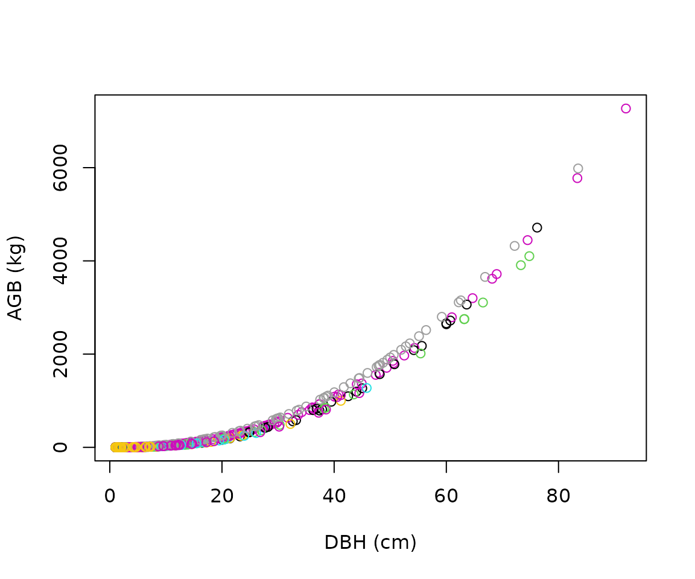
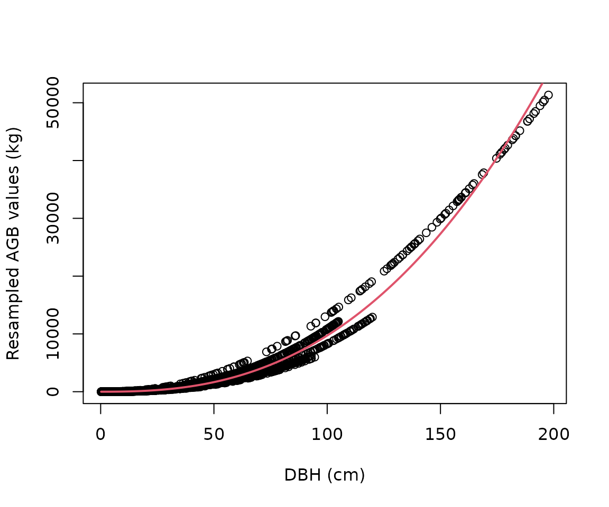
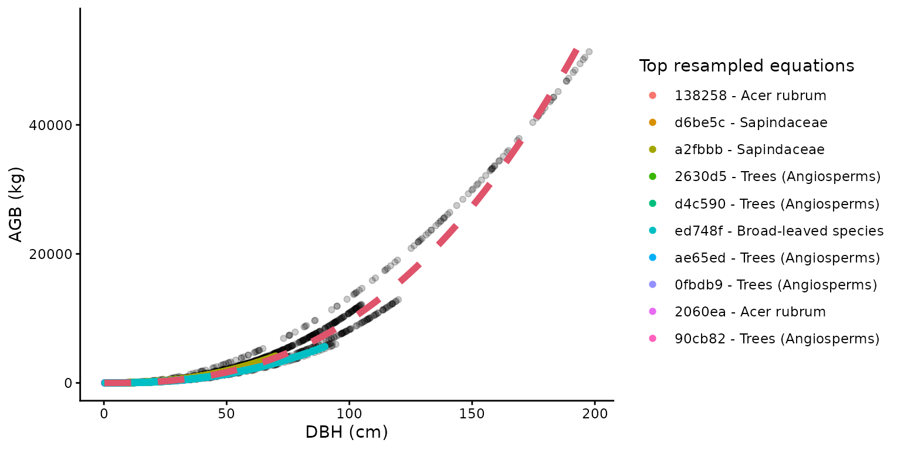
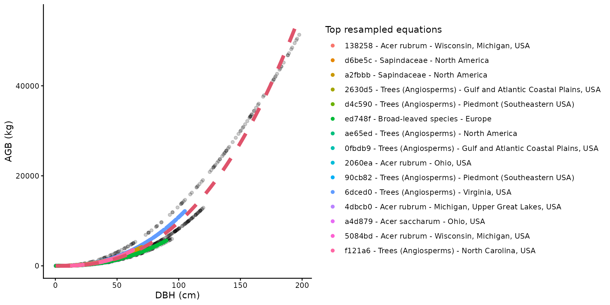

# Using allodb to estimate aboveground biomass

## Installation

Install the development version of *allodb* from GitHub:

``` r

# install.packages("pak")
pak::pak("ropensci/allodb")
```

## Load the census data

Prior to calculating tree biomass using *allodb*, users need to provide
a table (i.e. dataframe) with DBH (cm), parsed species Latin names, and
site(s) coordinates. In the following examples we use data from the
Smithsonian Conservation Biology Institute, USA (SCBI) ForestGEO
dynamics plot (1st census in 2008, trees from 1 hectare). Data can be
requested through the ForestGEO portal (<https://forestgeo.si.edu/>)

``` r

require(allodb)
#> Loading required package: allodb
data(scbi_stem1)
str(scbi_stem1)
#> Classes 'tbl_df', 'tbl' and 'data.frame':    2287 obs. of  6 variables:
#>  $ treeID : int  2695 1229 1230 1295 1229 66 2600 4936 1229 1005 ...
#>  $ stemID : int  2695 38557 1230 32303 32273 31258 2600 4936 36996 1005 ...
#>  $ dbh    : num  1.41 1.67 1.42 1.04 2.47 ...
#>  $ genus  : chr  "Acer" "Acer" "Acer" "Acer" ...
#>  $ species: chr  "negundo" "negundo" "negundo" "negundo" ...
#>  $ Family : chr  "Sapindaceae" "Sapindaceae" "Sapindaceae" "Sapindaceae" ...
```

## Load and modify the equation table

`allodb` provides a dataframe containing 570 parsed allometric
equations.

``` r

data(equations)
```

Additional information about the equation table can be found in the
equation metadata.

``` r

data(equations_metadata)
```

This equation table is the default in all functions of the package.
Users can modify the set of equations that will be used to estimate
biomass using the
[`new_equations()`](https://docs.ropensci.org/allodb/reference/new_equations.md)
function: users can work on a subset of those equations, or add new
equations to the table (see
[`?allodb::new_equations`](https://docs.ropensci.org/allodb/reference/new_equations.md)).
The customized equation table should be provided as an argument in the
[`get_biomass()`](https://docs.ropensci.org/allodb/reference/get_biomass.md)
(or other) function (argument name: `new_eqtable`).

### Subset the equation table

``` r

show_cols <- c("equation_id", "equation_taxa", "equation_allometry")
eq_tab_acer <- new_equations(subset_taxa = "Acer")
head(eq_tab_acer[, show_cols])
#> # A tibble: 6 × 3
#>   equation_id equation_taxa       equation_allometry                            
#>   <chr>       <chr>               <chr>                                         
#> 1 a4e4d1      Acer saccharum      exp(-2.192-0.011*dbh+2.67*(log(dbh)))         
#> 2 dfc2c7      Acer rubrum         2.02338*(dbh^2)^1.27612                       
#> 3 eac63e      Acer rubrum         5.2879*(dbh^2)^1.07581                        
#> 4 f49bcb      Acer pseudoplatanus exp(-5.644074+(2.5189*(log(pi*dbh))))         
#> 5 14bf3d      Acer mandshuricum   0.0335*(dbh)^1.606+0.0026*(dbh)^3.323+0.1222*…
#> 6 0c7cd6      Acer mono           0.0202*(dbh)^1.810+0.0111*(dbh)^2.740+0.1156*…
```

### Add new equations

``` r

eq_tab_add <- new_equations(
  new_taxa = c("Quercus ilex", "Castanea sativa"),
  new_allometry = c("0.12*dbh^2.5", "0.15*dbh^2.7"),
  new_coords = c(4, 44),
  new_min_dbh = c(5, 10),
  new_max_dbh = c(35, 68),
  new_sample_size = c(143, 62)
)
## show added equations - they contain "new" in their equation_id
head(eq_tab_add[grepl("new", eq_tab_add$equation_id), ])
#> # A tibble: 2 × 15
#>   equation_id equation_taxa   equation_allometry independent_variable
#>   <chr>       <chr>           <chr>              <chr>               
#> 1 new1        Quercus ilex    0.12*dbh^2.5       DBH                 
#> 2 new2        Castanea sativa 0.15*dbh^2.7       DBH                 
#> # ℹ 11 more variables: dependent_variable <chr>, long <chr>, lat <chr>,
#> #   koppen <chr>, dbh_min_cm <dbl>, dbh_max_cm <dbl>, sample_size <dbl>,
#> #   dbh_units_original <chr>, dbh_unit_cf <dbl>, output_units_original <chr>,
#> #   output_units_cf <dbl>
```

## Estimate the aboveground biomass

The aboveground biomass (AGB) can be estimated using the
[`get_biomass()`](https://docs.ropensci.org/allodb/reference/get_biomass.md)
function: the required arguments are the diameter at breast height (DBH,
in cm), the taxonomic identification (to the genus or species level),
and the location (long-lat coordinates). The output is the aboveground
biomass of the tree in kg.

``` r

get_biomass(
  dbh = 50,
  genus = "liriodendron",
  species = "tulipifera",
  coords = c(-78.2, 38.9)
)
#> [1] 1578.644
```

The
[`get_biomass()`](https://docs.ropensci.org/allodb/reference/get_biomass.md)
function can also be used to estimate the AGB of all trees in one (or
several) censuses.

``` r

scbi_stem1$agb <-
  get_biomass(
    dbh = scbi_stem1$dbh,
    genus = scbi_stem1$genus,
    species = scbi_stem1$species,
    coords = c(-78.2, 38.9)
  )
```

``` r

plot(
  x = scbi_stem1$dbh,
  y = scbi_stem1$agb,
  col = factor(scbi_stem1$genus),
  xlab = "DBH (cm)",
  ylab = "AGB (kg)"
)
```



## How AGB is estimated

### Attribute a weight to each equation in the equation table for each taxon/location combination

Within the
[`get_biomass()`](https://docs.ropensci.org/allodb/reference/get_biomass.md)
function, new allometric equations are calibrated for each
taxon/location combinations in the user-provided dataframe. This is done
by attributing a weight to each equation in the equation table, based on
its sampling size, and taxonomic and climatic similarity with the
taxon/location combination considered.

``` r

allom_weights <-
  weight_allom(
    genus = "Acer",
    species = "rubrum",
    coords = c(-78, 38)
  )

## visualize weights
equ_tab_acer <- new_equations()
equ_tab_acer$weights <- allom_weights
keep_cols <-
  c(
    "equation_id",
    "equation_taxa",
    "sample_size",
    "weights"
  )
order_weights <- order(equ_tab_acer$weights, decreasing = TRUE)
equ_tab_acer <- equ_tab_acer[order_weights, keep_cols]
head(equ_tab_acer)
#> # A tibble: 6 × 4
#>   equation_id equation_taxa        sample_size weights
#>   <chr>       <chr>                      <dbl>   <dbl>
#> 1 138258      Acer rubrum                  150   0.415
#> 2 d6be5c      Sapindaceae                  243   0.383
#> 3 a2fbbb      Sapindaceae                  200   0.349
#> 4 2630d5      Trees (Angiosperms)          886   0.299
#> 5 d4c590      Trees (Angiosperms)          549   0.289
#> 6 ed748f      Broad-leaved species        2223   0.270
```

### Resample equations

Equations are then resampled within their original DBH range: the number
of resampled values for each equation is proportional to its weight (as
attributed by the
[`weight_allom()`](https://docs.ropensci.org/allodb/reference/weight_allom.md)
function).

``` r

df_resample <-
  resample_agb(
    genus = "Acer",
    species = "rubrum",
    coords = c(-78, 38),
    nres = 1e4
  )

plot(
  df_resample$dbh,
  df_resample$agb,
  xlab = "DBH (cm)",
  ylab = "Resampled AGB values (kg)"
)
```


### Calibrate a new equation for each taxon/location combination

The resampled values are then used to fit the following nonlinear model:
$`AGB = a \cdot dbh ^ b + e`$, with i.i.d.
$`e \sim \mathcal{N}(0, sigma^2)`$. The parameters (*a*, *b*, and
*sigma*) are returned by the
[`est_params()`](https://docs.ropensci.org/allodb/reference/est_params.md)
function. In other words, this function calibrates new allometric
equations from sampling previous ones. New allometric equations are
calibrated for each species and location by resampling the original
compiled equations; equations with a larger sample size, and/or higher
taxonomic rank, and climatic similarity with the species and location in
question are given a higher weight in this process.

``` r

pars_acer <- est_params(
  genus = "Acer",
  species = "rubrum",
  coords = c(-78, 38)
)
plot(
  df_resample$dbh,
  df_resample$agb,
  xlab = "DBH (cm)",
  ylab = "Resampled AGB values (kg)"
)
curve(pars_acer$a * x^pars_acer$b,
  add = TRUE, col = 2, lwd = 2
)
```



The
[`est_params()`](https://docs.ropensci.org/allodb/reference/est_params.md)
function can be used for all species/site combinations in the dataset at
once.

``` r

params <- est_params(
  genus = scbi_stem1$genus,
  species = scbi_stem1$species,
  coords = c(-78.2, 38.9)
)
head(params)
#> # A tibble: 6 × 7
#>   genus       species      long   lat      a     b sigma
#>   <chr>       <chr>       <dbl> <dbl>  <dbl> <dbl> <dbl>
#> 1 Acer        negundo     -78.2  38.9 0.0762  2.55  433.
#> 2 Acer        rubrum      -78.2  38.9 0.0768  2.55  412.
#> 3 Ailanthus   altissima   -78.2  38.9 0.0995  2.48  377.
#> 4 Amelanchier arborea     -78.2  38.9 0.0690  2.56  359.
#> 5 Asimina     triloba     -78.2  38.9 0.0995  2.48  377.
#> 6 Carpinus    caroliniana -78.2  38.9 0.0984  2.48  317.
```

AGB is then recalculated as `AGB = a * dbh^b` within the
[`get_biomass()`](https://docs.ropensci.org/allodb/reference/get_biomass.md)
function.

## Visualize the recalibration of equations

The recalibrated equation for one taxon/location combination can be
easily visualized with the
[`illustrate_allodb()`](https://docs.ropensci.org/allodb/reference/illustrate_allodb.md)
function, which returns a ggplot (see package `ggplot2`) with all
resampled values, and the top equations used displayed in the legend.
The user can control the number of equations and equation information
shown in the legend. The red dotted line is the recalibrated equation
used in the
[`get_biomass()`](https://docs.ropensci.org/allodb/reference/get_biomass.md)
function.

``` r

illustrate_allodb(
  genus = "Acer",
  species = "rubrum",
  coords = c(-78, 38)
)
```



``` r

illustrate_allodb(
  genus = "Acer",
  species = "rubrum",
  coords = c(-78, 38),
  neq = 15,
  eqinfo = c("equation_taxa", "geographic_area")
)
```


